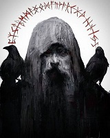

# 神与祭司

|神明|称号|阵营|象征|武器|领域|
|:-:|:-:|:-:|:-|:-:|:-:|
|【猎手】||N|月亮||
|【信使】||LE|水星||
|【舞女】||CG|金星||
|【太阳】||NG|太阳||
|【战争】||CE|火星||
|【繁荣】||LG|木星||
|【隐者】|独眼的全知者|NE|土星、独眼、乌鸦|矛|知识、秘密、魔法、战争|
|【创造】||LN|天王星||
|【梦境】||CN|海王星||
|【死亡】||N|冥王星|镰刀|

## 【隐者】（NE）

**典范**：不惜一切代价获得力量与知识，并保守它们的秘密。

**禁忌**：面对牺牲患得患失，甚至半途而废。泄露秘密。

**武器**：矛

**领域**：知识、秘密、魔法、战争

**法术**：

**神话**：【隐者】一般被描绘为一位白色长须的独眼老者，他通常披着灰色的斗篷，手握一根木棍，肩膀上停着两只乌鸦，但也有祭司把他描绘成身披重甲，手握矛和盾的模样。【隐者】通常被描述成一个严肃冷酷的神明，他对世间的一切几乎都漠不关心。
- **独眼的全知者**：传说他以灵魂为代价前往了世界的边缘，并以一只眼和一只手为代价获得了过去、现在、未来的一切知识，并由凡人成为了不朽的存在。
- **黑暗的守秘人**：传说他在世界之外知晓了无数的禁忌的秘密，任何人哪怕知晓其中的一件都可能陷入疯狂。
- **投掷流星之人**：传说他手中的矛是从世界树上折下的枝杈，只要投出就会化作流星。

**信徒**：【隐者】的祭司通常是避世的隐修者，他们在人迹罕至之处建立隐修会；在隐修会中祭司们收集和保存各种秘密，磨练自己的技能；同时也教导那些他们认为有资格学习同时也能保守秘密的人。隐修会不欢迎新的信徒，每个隐修会都有自己严格的一套筛选标准。
- **秘传的武术**：隐修会中有许多武术家，他们为了在使用时能够达到出其不意、一击必杀的效果，对自己的武艺秘不授人。
- **遁世的巫师**：极少有人具有魔法的天赋，人类的主流文明也普遍排斥甚至迫害巫师，为逼人耳目他们往往会前往隐修会寻求庇护。

**关系**：【隐者】不是个受人欢迎的神明，他的信徒也都是一群为达目的不则手段的人，大部分领主都不会喜欢自己的领地上出现这么一群潜在的危险分子，不过少数野心勃勃的领主可能和隐修会进行合作。
